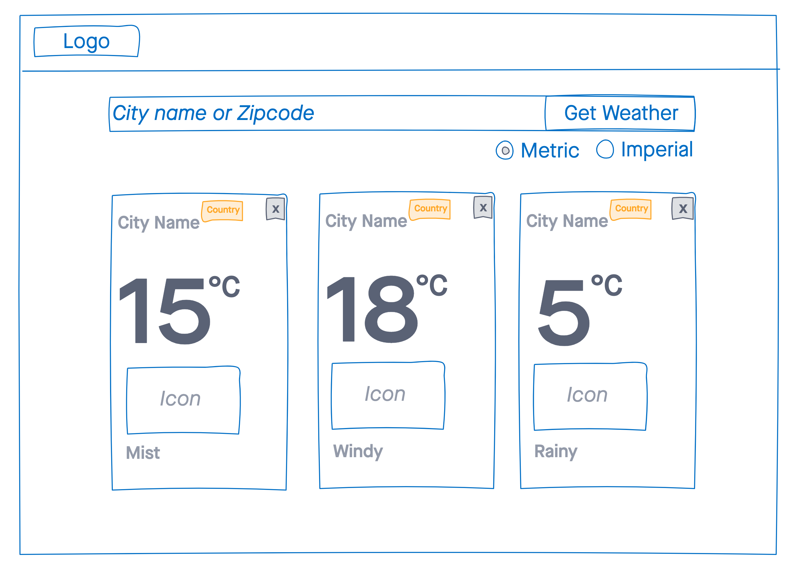

### Objective
Objective is to test the knowledge in the following areas
- Project setup and scaffolding
- Coding Standards
- GIT knowledge
- UI/UX design knowledge
- React knowledge

### Instructions
- Clone this repository
- Create a new branch
- Create a new react project
- Create a Header, footer, stats card and chart card components as reusable components
- Using the freehand design provided as guide, develop an App dashboard consuming resuable components

api.openweathermap.org/data/2.5/weather?q={city name}&appid={API key} is the API url that you would need to call for obtaining the data.

> The UX/UI, Libraries is totally up to you. Feel free to use any and all resources available on the internet.

## How we review

All the objectives mentioned above are candidate for evaluation

**We value quality over feature-completeness**. It is fine to leave things aside provided you call them out. The goal of this exercise is to help us identify what you consider production-ready code.

 _Good Luck_ !!